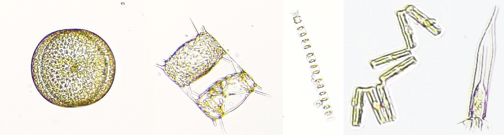
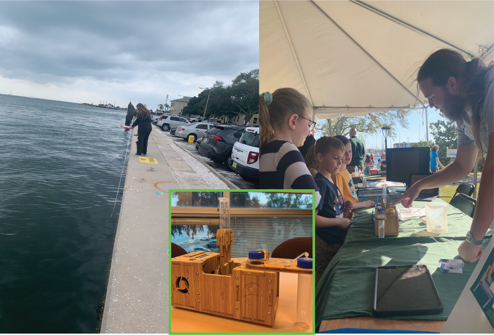
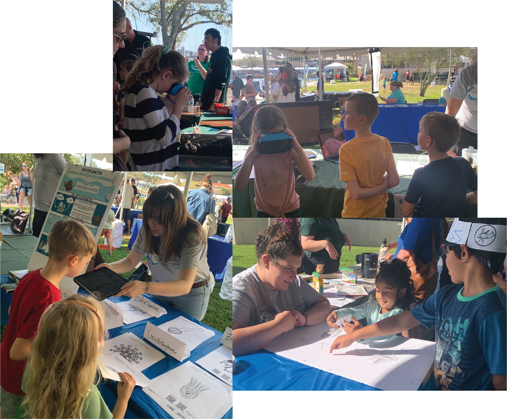

::: {layout="[10,-2,30]" layout-valign="center"}

**By Andreas Norlin, MICOlab PhD student**
:::

Feb. 10, 2024

Encouraging young people to be curious about the world is one of the most important things we can do. Asking questions and seeking out the truth are valued skills that we should encourage and nurture early on. Because of this, it is always exciting as a scientist to participate in events where we can show off the amazing things we see and learn in the lab and field to the general public. The St. Petersburg Science Festival is an annual event taking place at the St. Petersburg campus of the University of South Florida. The festival spans 2 days of fun and educational science activities, and this year the event took place on 9 to 10 February.

In the MICOlab at the University of South Florida, College of Marine Science, we study microbial interactions in a changing ocean, which is a fancy way of saying that we look at the smallest life on earth and see how their interactions are affected by the large-scale changes we are currently seeing in the world, such as increasing heatwaves and extreme storms. At the base of our food web are the primary producers, which use solar energy to convert atmospheric CO2 into organic molecules—such as sugars and starch—that can be consumed by other organisms. On land, the primary producers are plants and trees. In the Ocean, however, most of these primary producers are tiny microscopic single-celled organisms that float around with the ocean currents —the phytoplankton. Phytoplankton come in many shapes and forms and interact with each other and other microbes—like bacteria, viruses, and protists—in a variety of ways that can help them or harm them in different circumstances. They can even span a spectrum of being fully dependent on their innate ability to perform photosynthesis to stealing this ability from other microbes that they hunt and consume. The counterparts to herbivores and predators on land are the consumers in the ocean. On the microscopic level, these are most commonly called zooplankton, and they are the first links in the food web between primary producers and larger animals such as fish and whales. By grazing different phytoplankton species, zooplankton control the size and diversity of phytoplankton communities. 

\
*Phytoplankton diversity in Tampabay and a micro-zooplankton cell (far right: tintinnid ciliate). These cells were imaged with the MICOlab’s Planktoscope.* 

But how can we convey all these concepts to a more general audience? The organisms we study are so tiny that we need highly specialized equipment and methods to study them in the ocean, we can’t just put them on a table and show them to people. The most rudimentary piece of equipment that we use is a microscope, which magnifies a single sample at time. While a basic instrument for us, microscopes are actually complex and powerful—they are capable of magnifying things 500x meaning that a strain of hair would look like it was 2 inches wide! A microscope is a great way to share our microscopic world, but they can be cumbersome to use and only one person can use it at a time. By combining a microscope with fluidics and a high-speed camera, we get a tool called a Planktoscope**.** When we run a plankton sample through the Planktoscope, a small volume is pumped into a flow cell, which spreads the sample out so that it is thin enough that no cells can overlap, and a photo is taken. Then the part of the sample that was imaged is pumped out and more is pumped in and photographed. The planktoscope takes a new photo every 3–5 seconds so we can image a large amount of plankton very quickly. The best part is that we can all watch the plankton being imaged on a monitor! At the St. Petersburg Science Festival, we brought our Planktoscope, which we used to showcase the microscopic organisms in the water right off the sea wall at the College of Marine Science. On this day, we mostly found diatoms (phytoplankton) and copepods (zooplankton), which is what we would expect during early spring in Tampa Bay.

*Left: MICOlab member pulling a plankton net along the USF College of Marine Science seawall in Tampa Bay. Center (inset): Our Planktoscope. Planktoscopes are low-cost, modular, self-buildable, and highly portable highthroughput imaging microscopes. Right: Andreas explaining how the Planktoscope works to a group of Science Festival visitors.* 

The Planktoscope was just one tool we brought with us to share the wonderful world of plankton with St. Pete. We also brought a Virtual Reality (VR) headset for guests to (almost) truly dive into the plankton. Planktomania is a large outreach program developed by researchers in France. Together with artists, they designed an immersive VR app that lets users be completely surrounded by 3D representations of the major plankton groups. Without fail, guests of all ages were completely wowed by the experience. We used the Planktoscope and VR experience as a springboard to offer children and the young at heart an opportunity to color in one of many planktonic organisms. Here again, Planktomania spiced things up. There is also an Augmented Reality (AR) version of the Planktomania app that makes the plankton pop out of the page PokemonGO style when the coloring pages are viewed through a phone or tablet camera. We also had a little puzzle where the visitors could reassemble a food chain by velcroing different organisms onto a big poster board. 

*Clockwise from top: A Science Festival guest immersed in virtual reality plankton exploration; Guests visiting the MICOlab Science Festival exhibit looking into the virtual reality headset and viewing Planktoscope images on the monitor; Science Festival guests completing the food web puzzle; Guests looking at plankton coloring sheets pop out the page with augmented reality.*

All in all, our exhibit at the Science Festival was a success. We could barely take even short breaks because we always had a group of visitors asking us great questions about plankton. Our overall impression was that we had met our goal of communicating our science and ultimately, children and parents alike were awed by plankton.

As scientists, we are often immersed in our own little worlds, where we can forget that what we do is actually interesting and exciting to other people as well. Getting to share our world with science enthusiasts is an experience that is equally important to us as to those we share with. The experience of sharing the cool things we do with people who are just excited about learning something new is extremely motivating. Enthusiasm for science at events like the Science Festival is almost always championed by kids and it is our duty as both scientists and adults to keep this enthusiasm alive and to encourage the next generation of scientists to grow up and keep pushing the world to become a better place. 
