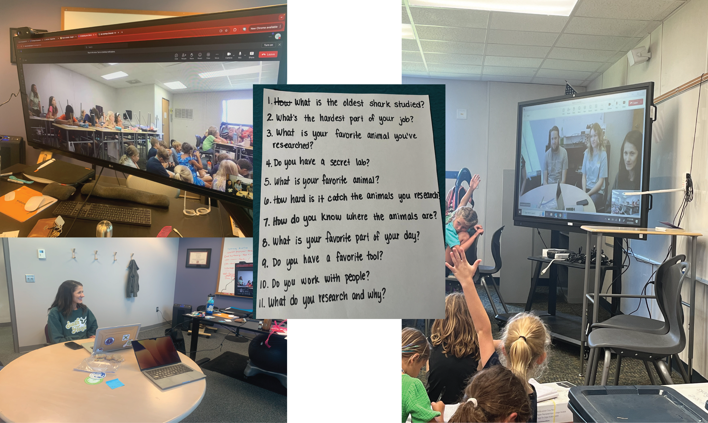

::: {layout="[10,-2,30]" layout-valign="center"}

**By Lydia Ruggles, MICOlab MSc student**
:::

May 22, 2024

It is easy not to see a room full of oceanographers, astronauts, and chemists when first meeting an elementary school class. But with some encouragement, they certainly could become these things someday! As scientists, we can excite young students about the vast world of science, and we may well spark the curiosity that carries them into their future careers. MICOlab members share a passion for inspiring young scientists. Most recently, this passion led to the lab zooming with a second grade class to share what it is like to be a marine scientist and a little bit about our research.

Through a zoom session connecting our lab to Pine Island Academy, the MICOlab taught 2nd graders from Jacksonville, FL about life as a marine scientist. The second graders had been learning about the ocean zones, tides, and marine organisms, which excited them to talk to real marine biologists. The class came to this event with a vast curiosity for the methods used to study both micro- and macroscopic organisms and developed several questions ranging from, “What is the hardest part of your job?” to “ Do you have a favorite research tool?” 

We shared our different experiences from embarking on cruises in the Southern Ocean to tagging sharks in the Gulf of Mexico. By recounting our experiences, we taught the students how research can be done in labs found in universities or on giant research vessels. We covered topics such as how we know where to look for the organisms we research, what phytoplankton use for food, and what education is needed to become a researcher. The MICOlab showed images of research excursions consisting of sediment coring, water sampling, and the most-loved, shark tagging! The meeting ended with students exclaiming they wanted to be marine scientists! We followed up with second-grade teacher, Megan Heisele, who reported students were discussing phytoplankton and sharks the rest of the day! 

The MICOlab is already planing to speak to this school again next year and to involve more grades. If you are a teacher and would like us to zoom into your classroom, please contact us! We are looking forward to sharing our research discoveries with all the future scientists.

*Top Left: MICOlab's view of the second graders at Pine Island Academy; Center: Questions prepared by the Pine Island Academy second graders. Our favorite was about our secret labs :). Right: The view from Pine Island Academy. Bottom Left: Lydia explaining MICOlab research goals to the second graders.  *