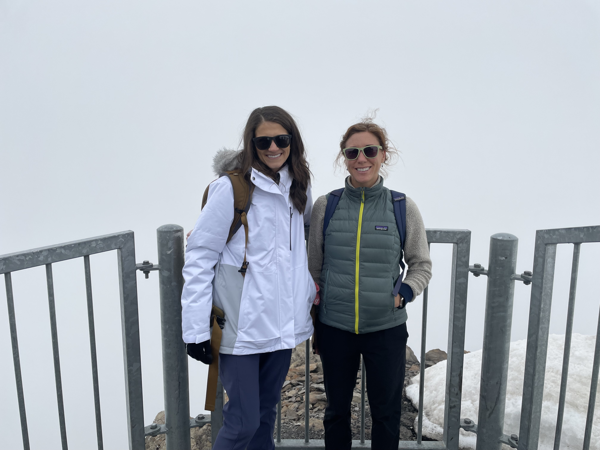
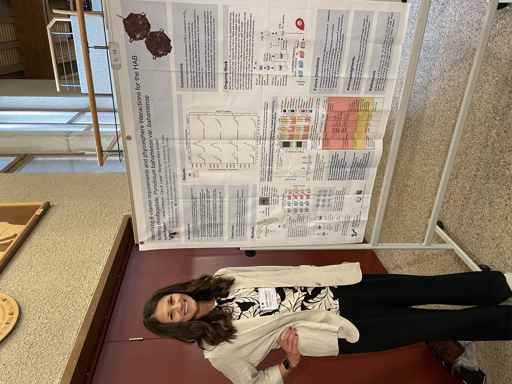
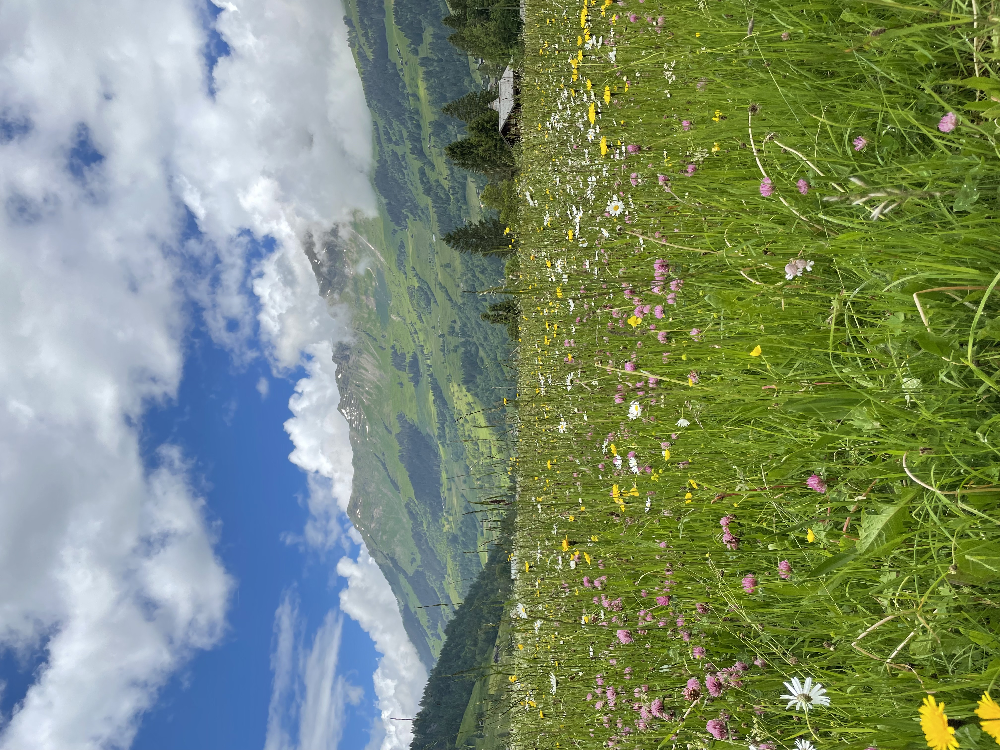

::: {layout="[10,-2,30]" layout-valign="center"}

**By Lydia Ruggles, MICOlab M.S. student**
:::

June 20, 2024

When I started my career as a graduate student, I had only heard about how conferences are fantastic opportunities to network and learn. In my first semester, my advisor presented me with the opportunity to attend a Gordon Research Conference (GRC) for marine microbes. To attend the GRC, I applied for a highly competitive Southeast Coastal Ocean Observing Regional Association (SECOORA) grant. This required a lot of writing and focusing on preliminary research to submit, which paid off as I was offered the award!

When I read the conference location, I had to re-read it because the conference was in Switzerland! But why was a marine microbes conference scheduled in the Swiss Alps? Once I got there, it made sense. The conference was small with around 200 attendees consisting of well-known scientists and graduate students from all over the world. The remoteness of the conference allowed for meaningful conversations and brainstorming about marine microbe research. 

Each day, the conference started with all attendees having breakfast together followed by a series of speakers. It was exciting to listen to the speakers talk about their different research, ranging from microbes found in whales to the deep-sea. After the morning talks, there was a one-minute lightning-talk session, where all the poster-presenters gave a little speech advertising their poster. When my time came to present, I was nervous because I am only a first-year graduate student, why would esteemed scientists want to listen to me? But as I gave my speech, everyone seemed so engaged, which filled me with confidence! 

After lightning-talk sessions, we all had lunch together, which allowed for great discussions about the morning talks! However, we were in the Swiss Alps, so we had to do some exploring! Thankfully, the conference allotted three hours after lunch to explore, which I filled with a lot of hiking with amazing researchers!

 *Lydia and Maggi summit Glacier 3000.*

After exhausting but exhilarating hikes, we returned to the conference center to attend the poster session. On the third day of the conference, I presented my poster. Because everyone there was very positive and engaging, I felt good about my research, but don’t get me wrong, I was still a little nervous. The poster session created a space for me to share and get amazing feedback on my research that my lab and I have been working hard on. This was my favorite part of the conference because I was able to take others’ advice for the research I am doing today.  

 *Lydia presenting her poster at the 2024 GRC on Marine Microbes in Switzerland.*

Overall, the conference was one of the best experiences I have had, and not just because of the breathtaking location. Since then, I have connected with some of the scientists I have met and participate in a WhatsApp chat with all of the graduate students! In what other situation would I learn from scientists who are interested in the same topic of marine microbes? I highly recommend attending a conference, participating in a poster session, or giving a talk. Who knows, you may receive the best piece of advice that improves your research or network with scientists that change the trajectory of your career.

 *Mountain scenes in Les Diablerets.*

