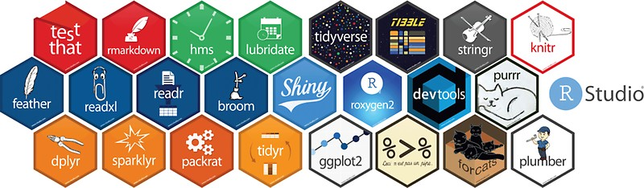
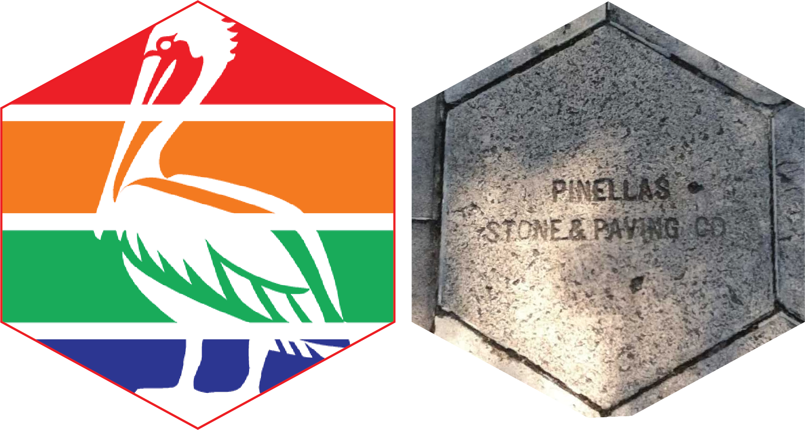

**General inquiries can be made to:**

mmarsbrisbin (at) usf.com

**Interested in joining the MICO lab?**

Undergraduates at USF St. Pete:

-   Undergraduates seeking research experience can sign up for research credits with Prof. Brisbin to count toward their dgree completion. Contact Prof. Brisbin about available opportunities.

PhD opportunities:

-   [USF College of Marine Science Graduate program](https://www.usf.edu/marine-science/education/prospective-students/how-to-apply.aspx) \| *apply by December 15*
-   [NSF Graduate Research Fellowship Program (GRFP)](https://www.nsfgrfp.org/) \| *Deadline: mid-October*

Postdoc opportunities:

-   [NSF Ocean Sciences Postdoctoral Research Fellowships](https://www.nsf.gov/pubs/2021/nsf21538/nsf21538.htm) \| *Deadline: mid-November*
-   [NSF Office of Polar Programs Postdoctoral Research Fellowships](https://new.nsf.gov/funding/opportunities/office-polar-programs-postdoctoral-research) \| *Deadline: early February*
-   [Simons Foundation Postdoctoral Fellowship in Marine Microbial Ecology](https://www.simonsfoundation.org/grant/simons-postdoctoral-fellowships-in-marine-microbial-ecology/) \| *Deadline: mid-May*

----------

**Wondering why all the hexagons?**

1. We love R! 

2. We love St. Petersburg (the home of USF CMS in Pinellas County, Florida)!

Sidewalks in historic neighborhoods throughout St. Pete are made from tessellating hexagon cement paving stones. As a result, the hexagon is widely used to symbolize St. Pete and is the logo of [Preserve the Burg](https://www.preservetheburg.org/about), St. Pete's historical preservation society. 
