### 2026

::: {layout="[10,-2,30]" layout-valign="center"}
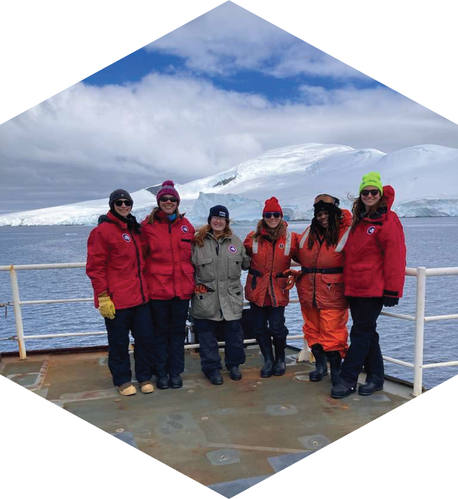

**\[NEWS\] Jan 6–Feb 16 - Maggi is co-chief scientist on Antarctic research expedition aboard the R/V Sikuliaq **   
Maggi, along with Co-PIs Tricia Thibodeau (UNE) and Ellen Buckley (UI-UC), graduate students, and another science team led by Tom Tobin (Alabama), departed from Punta Arenas, Chile, headed towards Seymour Island in the Weddell Sea. Maggi and colleagues are studying sea ice and its impacts on primary production, carbon export, and food webs through a multi-pronged approach including ice coring, water-column observing, net tows, and incubation experiments. The Tobin team intends to camp on Seymour Island and study micro fossils from the K-Pg boundary while our team takes advantage of the oceanographic capabilities of the Sikuliaq. 

 
:::

### 2025

::: {layout="[10,-2,30]" layout-valign="center"}

**\[NEWS\] December 22 - First MICOlab preprint is posted! **   
The manuscript version of Lydia's thesis has been submitted for peer-review and is up on bioRxiv! Read it here:  https://www.biorxiv.org/content/10.64898/2025.12.19.695638v1

 
:::

::: {layout="[10,-2,30]" layout-valign="center"}
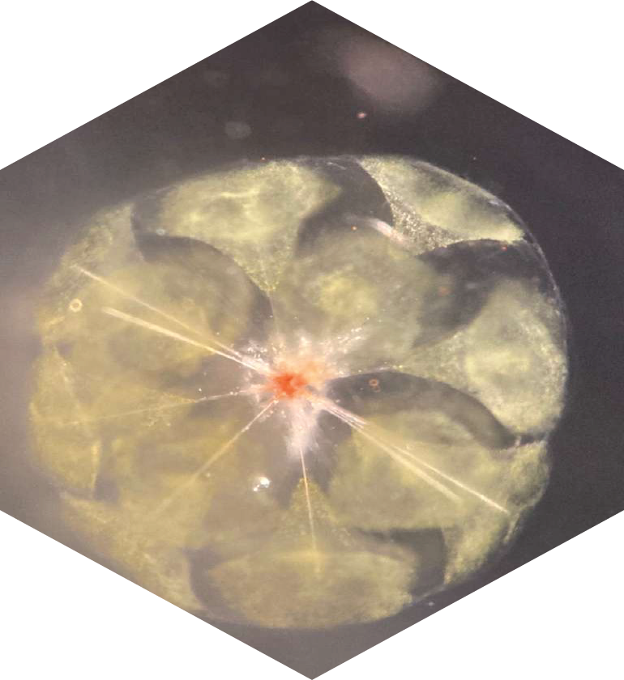

**\[NEWS\] December 17–29 Maggi participates in a research cruise aboard the R/V Sally Ride in the Gulf of California **   
Maggi joined the Seibel lab and researchers from URI and the University of Arizona on a cruise aboard the R/V Sally Ride in the Gulf of California studying oxygen minimum zones, zooplankton, and vertical migrators. Maggi served as a scientific diver, hand collecting zooplankton for Seibel lab respirometry experiments to determine metabolic rates. As a bonus, she also hand-collected giant acantharians and measured their net primary production through oxygen production. The giant acantharians were also stored in RNA/DNA shield for later genetic studies of both the acantharians and their symbionts.  
 
:::

::: {layout="[10,-2,30]" layout-valign="center"}

**\[NEWS\] December 12 - Lydia is the first student to complete an M.Sc. in the MICOlab and graduate from USF CMS!! **   
Lydia successfully completed all requirements for a Master of Science degree from the USF College of Marine Science and walked in the graduation ceremony on main campus. We are all SO proud of her! Congratulations, Lydia!!!

 
:::

::: {layout="[10,-2,30]" layout-valign="center"}
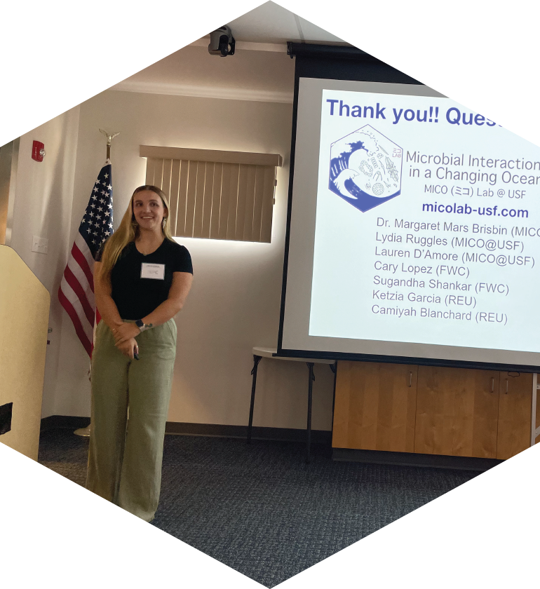

**\[NEWS\] October 17–19 Maggi and Lilianna present research at the South East Phycological Colloquy (SEPC) hosted at the VIMS Eastern Shore Laboratory **   
Maggi and Lilianna travelled to the eastern shore of Virginia together to present MICOlab research at SEPC. Lilianna compiled all the results from our summer project investigating the effects of microbiome composition, temperature, salinity, and nitrogen on *P. bahamense* growth and toxin production, along with several follow-up experiments she designed and completed during the summer and fall semesters. It was Lilianna’s first conference presentation and it was extremely well received, spurring ongoing conversation throughout the meeting. We also enjoyed networking with other algal researchers during a seafood boil and a boat trip to the barrier island to look for algae. Lilianna and Maggi roomed with the [Reich Lab @ ESF](https://phycosymbiosis.weebly.com/publications.html) in a small cabin on site for further scientific bonding and exchange of ideas. SEPC is a great regional meeting for students, we will definitely attend again!

 
:::

::: {layout="[10,-2,30]" layout-valign="center"}

**\[NEWS\] Sept. 24 - Lydia Ruggles is the first MICOlab student to defend her thesis! **   
Lydia presented her thesis results to the public and successfully defended her thesis, titled: “Identifying B-vitamin requirements and phycosphere interactions for the HAB forming dinoflagellate, *Pyrodinium bahamense* var. *bahamense*”. Lydia’s masters thesis included a huge amount of data from multiple long-term experiments and a large amount of Nanopore sequencing. She found that *P. bahamense* requires cobalamin—but not thiamine or biotin—to grow, and that bacteria can provide cobalamin to *P. bahamense*. Perhaps most interestingly, she found that bacteria isolated from a *P. bahamense* bloom restored *P. bahamense* growth when cobalamin was withheld, but bacteria from seawater collected when *P. bahamense* was not present did not have this effect. We celebrated Lydia’s success by presenting her with a custom, lab-built thesis hat and a “code cake”. We headed to the Tavern just after the results were announced and all went out to dinner at Pia’s to continue the celebration!  

 
:::

::: {layout="[10,-2,30]" layout-valign="center"}
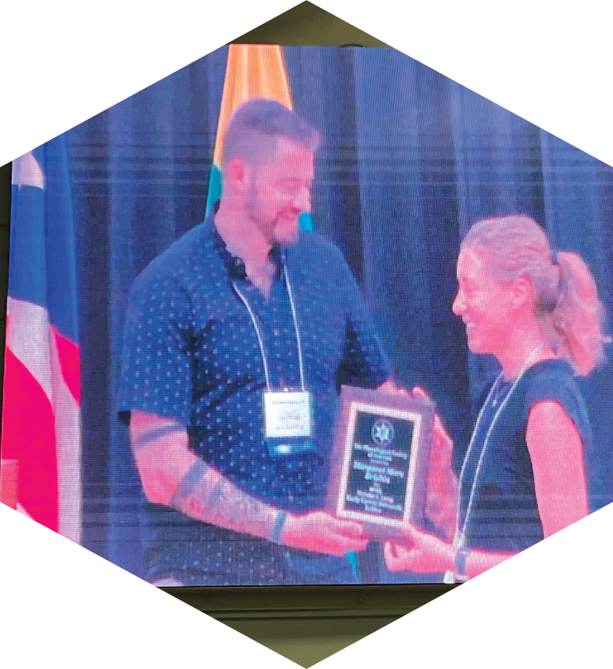

**\[NEWS\] July 28–August 1 - Maggi is awarded the PSA Norma J. Lang Early Career Fellowship at the Phycological Society of America's meeting in San Juan, Puerto Rico **   
The [Norma J. Lang Early Career Fellowship](https://www.psaalgae.org/norma-j-lang-fellowships) is awarded annually by PSA to provide seed money for larger grants in the future and to kickstart the careers of scientists early in their faculty appointment. Lang Fellows serve the society for their three year appointment by serving on committees, attending the annual meeting, and evaluating applications for future Lang fellowships. PSA is an exceptional scientific society that fosters community and scientific exchange while also supporting students and early career scientists. It is an incredible honor to have received the Lang fellowship this year! Maggi also gave a research presentation at the meeting and traveled to Vieqes with the [Reich Lab @ ESF](https://phycosymbiosis.weebly.com/publications.html) following the meeting to learn more about *Pyrodinium bahamense* in Puerto Rico. 

 
:::

::: {layout="[10,-2,30]" layout-valign="center"}
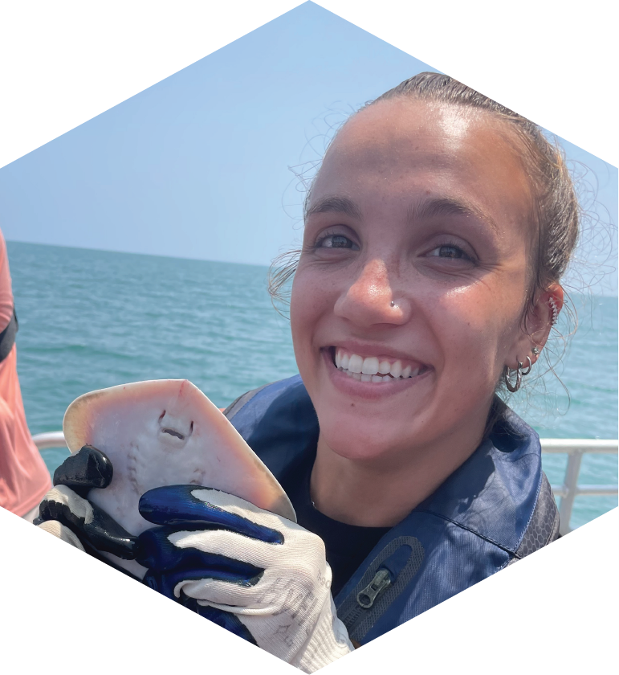

**\[NEWS\] July 1 - Lilianna Giuffrida joins MICOlab **   
Lilianna joined the MICOlab in July in advance of starting her M.S. degree at CMS in the fall. Lilianna graduated from Coastal Carolina University and developed a strong interest in algal research there through her senior thesis and other research experiences. This summer, Lilianna is getting a headstart on her thesis project investigating the vitamin sources to Tampa Bay and their impact on phytoplankton communities. She is also assisting in the REU project investigating the effects of different environmental variables on *P. bahamense* growth and toxin production. We are so excited to have Lilianna working with us this summer and beyond. Welcome, Lilianna!! 

 
:::

::: {layout="[10,-2,30]" layout-valign="center"}
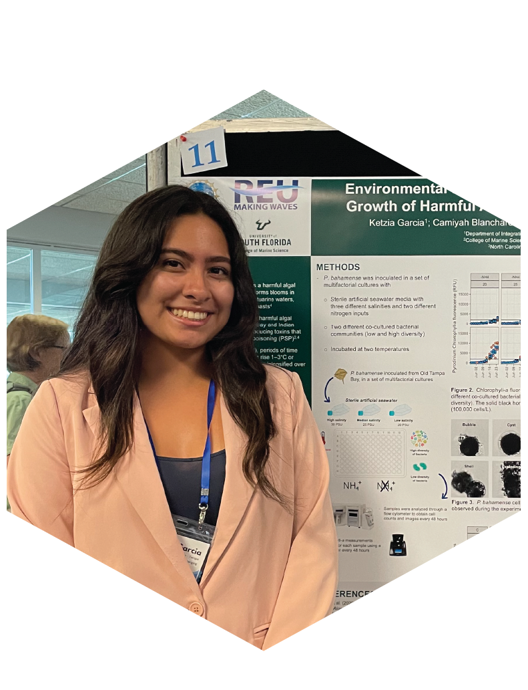

**\[NEWS\] May–July 2025 - MICO lab hosts two NSF REU students **   
From May–July 2025, the MICOlab hosted two NSF REU students—Ketzia Garcia and Camiyah Blanchard—from the Making Waves REU program at USF. The program includes cohort building activities, networking, and science communication training in addition to their scientific research. Ketzia and Camiyah worked together running a large factorialized experiment investigating how microbiome composition, nitrogen availability, salinity, and temperature affect *Pyrodinium bahamense* growth and toxin production. The two students took growth measurements every 48 hours by Chlorophyll-*a* fluorescence and imaging flow cytometry with the Attune CytPix Flow Cytometer. The flow cytometry allowed us to track *P. bahamense* and bacterial cell concentrations, as well as *P. bahamense* cellular morphology. The students also learned how to perform DNA extractions and PCR to determine if the experimental conditions caused the *P. bahamense* microbiomes to shift in composition. The experience culminated in creating and presenting research posters for the USF undergraduate research symposium, where Ketzia won runner-up for best poster. Both Ketzia and Camiyah are now in their senior years at USF and North Carolina A&T State University, respectively.

 
:::

::: {layout="[10,-2,30]" layout-valign="center"}
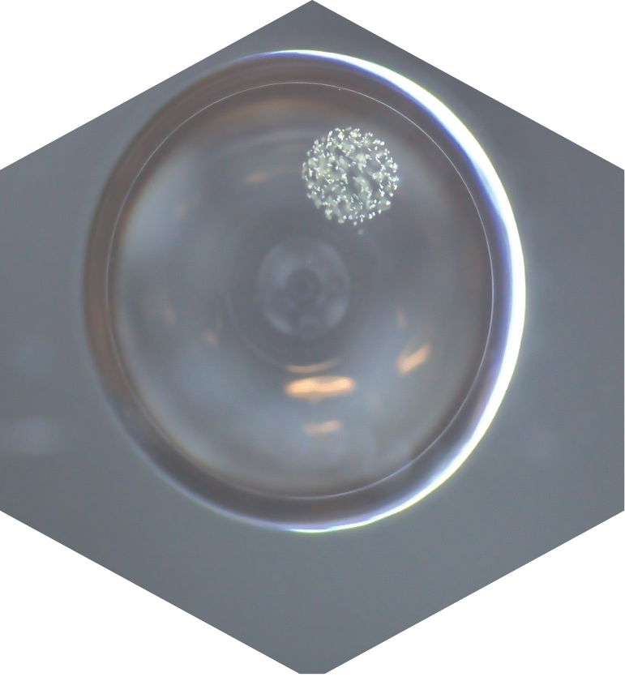

**\[NEWS\] July 7 - New research article by MICOlab PI, Maggi Mars Brisbin, published in the *Journal of Phycology* **   
Bacteria inhabit phytoplankton phycoshperes—the area around the phytoplankton cell that is chemically influenced its presence—and utilize metabolites there while also sharing resources that may influence phytoplankton growth. Maggi previously showed that *Phaeocystis globosa*—a Haptophye that makes large, high-carbon colonies—hosts a consistent microbiome that may supply essential B-vitamins to *P. globosa*, but may also compete for nitrogen when this critical nutrient is in low-supply. In the new paper, [“Exploring the Phaeosphere: Characterizing the microbiome of *Phaeocystis antarctica* colonies from the coastal Southern Ocean and laboratory culture”](https://onlinelibrary.wiley.com/doi/full/10.1111/jpy.70051), Maggi extends her study of *Phaeocystis* microbiomes to the *Phaeocystis* species that lives in Antarctic waters. The new study shows that *P. antarctica* colonies collected directly from the Southern Ocean sea surface have similar microbiomes to each other even when collected miles apart. The abundances of bacteria that make up large proportions of *P. antarctica* colony microbiomes correlate with the abundance of *Phaeocystis* in Southern Ocean seawater samples. However, when the *P. antarctica* was cultured and brought back to the lab, the colony microbiome significantly changed, and cold-loving bacterial groups were lost. These results show that *P. antarctica* microbiomes are important to its success in the Southern Ocean, but that the system should be studied *in situ*. Thus, continued Antarctic field-work is needed to fully understand how *P. antarctica* interacts with bacteria and forms large, high biomass blooms in the Southern Ocean. [**Full-text PDF available.**](https://drive.google.com/file/d/1aNpsTGO1u-y2bglaNi5LTHRQ7JA3eeKk/view?usp=sharing) 

 
:::

::: {layout="[10,-2,30]" layout-valign="center"}
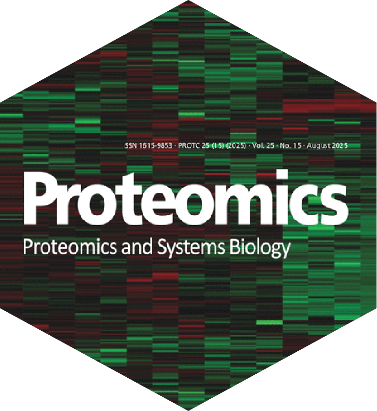

**\[NEWS\] June 11 - New research article by MICOlab PI, Maggi Mars Brisbin, published in the journal *Proteomics* **   
Databases are integral to analyzing any ‘omics data. A peptide, a transcript, a protein, a metabolite, etc., is often excluded from analysis if not already represented in a database. In the new paper,
[“Validation and Community Sharing of Ocean Spectral Libraries Generated by Machine Learning for Data Independent Acquisition Ocean Metaproteomic Analyses”](https://analyticalsciencejournals.onlinelibrary.wiley.com/doi/full/10.1002/pmic.13971), Maggi and colleagues tested a new type of database for discovering peptides and quantifying their abundance in metaproteomics samples deriving from complex ocean communities. Metaprotomics data collected in Data Independent Acquisition or DIA mode requires spectral libraries to discover peptides. Spectral libraries can be built from spectra attained in Data Dependent Acquisition (DDA) mode, but this limits how many peptides can be discovered with DIA and reduces the overall utility of DIA. Alternatively, spectral libraries can be built from genomic or transcriptomic data using machine learning algorithms, which enhances the utility of DIA, but this approach had not previously been applied to ocean metaproteomics. This study uses machine learning algorithms to build spectral libraries from metagenomes and metatranscriptomes from different oceanic communities and tests their performance. The study shows that a common spectral library built this way can be applied to many different samples. As a result, the new spectral libraries have been provided as a community resource to facilitate uptake of DIA metaproteomics in oceanography. [**Full-text PDF available.**](https://drive.google.com/file/d/1JZ0f-kkXtRru-4x6VLerBDxb65lI1Di2/view?usp=sharing)

 
:::

::: {layout="[10,-2,30]" layout-valign="center"}

**\[NEWS\] April 16 - Olivia passes her comprehensive exam and advances to candidacy! **   
Huge congratulations to Olivia, who officially became a Ph.D. candidate on April 16th, after passing her comprehensive examination! To advance to candidacy at USF CMS, students are required to pass both written and oral comprehensive exams. The written exam is five days, with the student answering questions from one committee member each day. Committee members are instructed to give students questions that could feasibly be answered in four hours, but students are allowed eight hours to complete their answers, and most students take advantage of the full eight hours to exhaustively answer questions. After the written exam period, the committee members review answers and determine if the student can advance to the oral exam. In the approximately two-hour oral exam, committee members follow up on written questions and answer new questions. Olivia’s exam included topics related to biological oceanography, coastal ecology, shellfish biology, education, and citizen science! 

 
:::

::: {layout="[10,-2,30]" layout-valign="center"}
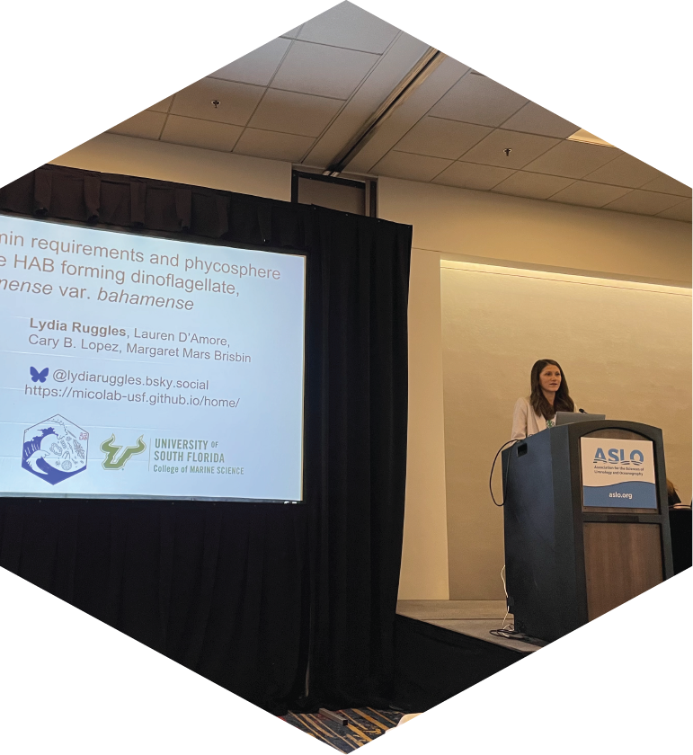

**\[NEWS\] April 15 - Lydia passes her thesis proposal defense!**   
Lydia successfully presented her thesis proposal to her thesis committee: [Mya Breitbart (USF CMS)](https://www.marine.usf.edu/genomics/), [Sugandha Shankar (FWC)](https://myfwc.com/research/redtide/labs-people/current/shankar/), and Maggi. The 30-minute presentation was an expanded and updated version of Lydia’s ASLO talk, which she had already refined and practiced extensively. The committee had some feedback and suggestions, but was extremely impressed with Lydia’s progress overall. She is cleared to finish up her last experiments and write up all her results. Lydia plans to defend her thesis in the Fall 2025 semester and graduate by the end of 2025. She will be the first graduate student to graduate from the MICOlab! 

 
:::

::: {layout="[10,-2,30]" layout-valign="center"}
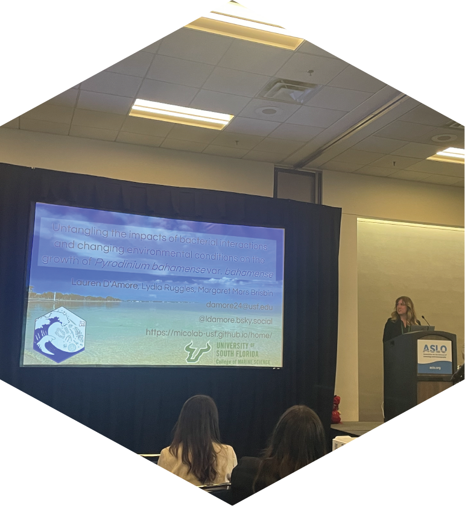

**\[NEWS\] March 26–31 - ASLO Aquatic Sciences Meeting in Charlotte, NC**   
Lauren, Lydia, and Maggi presented MICOlab research at the 2025 ASLO Aquatic Sciences Meeting. Lauren and Lydia were both awarded conference support from the Southern Association of Marine Labs ([SAML](http://saml.naml.org/members/studentawards.php)) that was central to their participation in ASLO. Lydia presented her thesis work on phycosphere interactions and vitamin requirements for the harmful algal bloom (HAB) forming dinoflagellate, *Pyrodinium bahamense*. This was Lauren’s first academic conference, and she presented her work on how interactions between changing environmental conditions and phycosphere bacteria influence *P. bahamense* growth in the Undergraduate Research session. Both of the presentations were followed by excellent questions and helpful feedback. Maggi presented results from the hurricane response cruises and discussed microbial responses to major hurricanes impacting Florida’s Gulf Coast as the invited speaker in the “Microbial responses to pulse disturbances in aquatic environments” special session. 

 
:::

::: {layout="[10,-2,30]" layout-valign="center"}
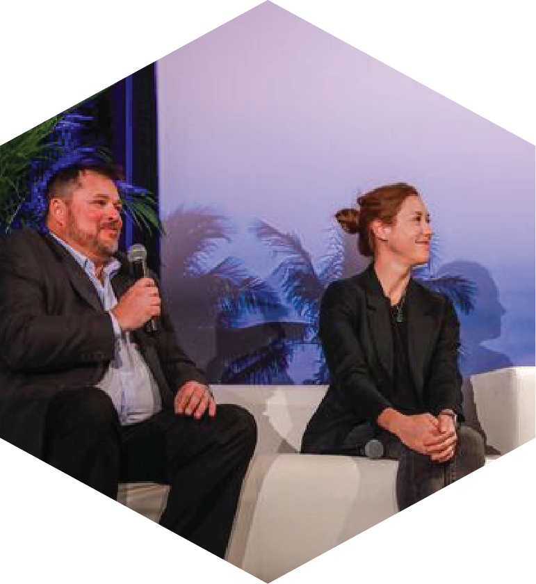

**\[NEWS\] March 6 - Tampa Bay Times’ Spotlight on Water Quality **   
Maggi joined water quality experts from around the bay for a community conversation about the state and future of Tampa Bay’s water quality, moderated by the Tampa Bay Times. Other panelists included: Ed Sherwood, the executive director of the Tampa Bay Estuary Program; Peter Clark, president and founder of Tampa Bay Watch; Santino Provenzano, the senior environmental director at The Mosaic Co.; and Warren Hogg, the chief science officer at Tampa Bay Watch. The conversation covered topics ranging from threats to Old Tampa Bay, including harmful algal blooms and seagrass loss, to how Tampa Bay area residents will acquire clean drinking water in the future. Some key takeaways: sustainable development and restoring natural shorelines will be key to ensuring the future health of the bay and getting outside and enjoying the bay is key to appreciating it and protecting it. Read more about the event and ensuing discussion in the Tampa Bay Times write-up here: [https://www.tampabay.com/news/environment/2025/03/07/5-takeaways-spotlight-tampa-bays-discussion-water-quality/]( https://www.tampabay.com/news/environment/2025/03/07/5-takeaways-spotlight-tampa-bays-discussion-water-quality/) 

 
:::

::: {layout="[10,-2,30]" layout-valign="center"}
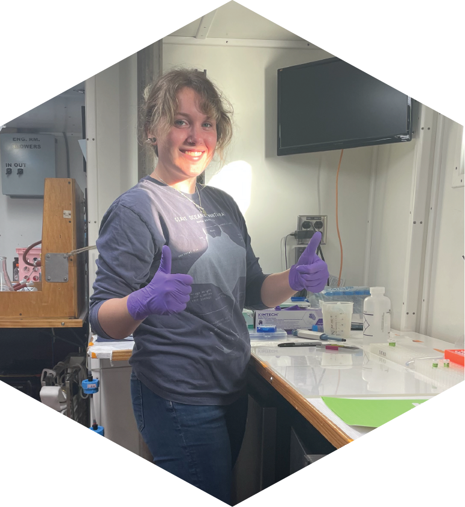

**\[NEWS\] Feb 24–26 - Red Tide Response Cruise **   
Maggi, Amanda, and Lauren headed out to sea with researchers from the Florida Fish and Wildlife Conservation Commission Research Institute for a short research cruise aimed at sampling a large *Karenia brevis* bloom. Before the cruise, aerial photographs and satellite measurements detected a massive red tide / *K. brevis* bloom offshore, and dead fish were washing up on beaches. The FWC organized an event response cruise to confirm the presence and abundance of *K. brevis* and measure additional parameters to help understand how and why such a massive bloom had developed. Just before we set sail, however, a large cold front passed through the region and the bloom dissipated. We sampled regions that still had some *K. brevis* present, which could help us understand what causes a bloom to end, whereas researchers are often more focused on what causes a bloom to start. We were also able to reoccupy stations that we sampled in the Hurricane Milton response cruises to gain additional insight into how resilient the Gulf Coast is to hurricane impacts. This cruise was Lauren’s very first research cruise, and she learned that she is an excellent seagoing scientist! When more seasoned researchers were unable to work due to sea sickness, Lauren stepped in and took on extra work: one more data point suggesting Lauren is going to have a successful career in marine science after graduating. Eric from FWC won the Ice Cream Competition by eating the most ice cream snacks during our 72-hour cruise (8!). Maggi was close behind with 6, and Lauren came in third place with 3.

 
:::

::: {layout="[10,-2,30]" layout-valign="center"}
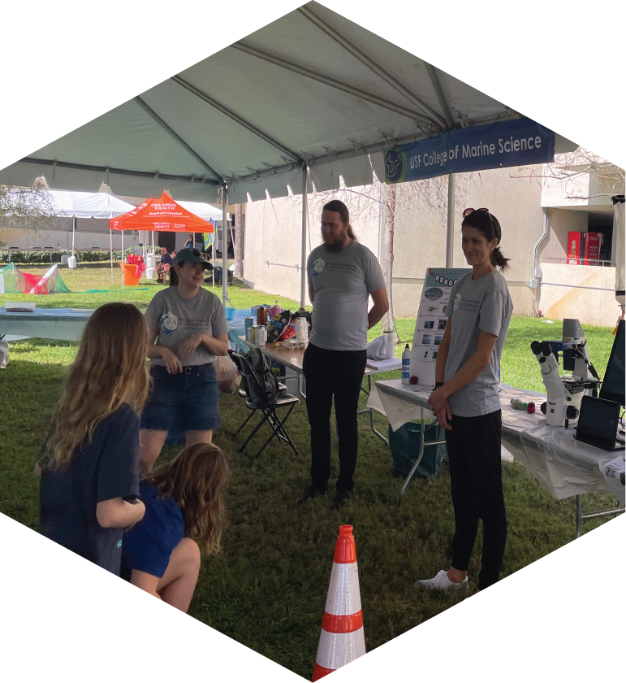

**\[NEWS\] Feb. 7–8 - St. Pete Science Fest **   
The MICOlab participated in the St. Pete Science Festival for a second year, and this time we participated in both the school day and the community day! On Friday, Lydia, Olivia, and Andreas taught groups from St. Pete schools about phytoplankton in Tampa Bay. Students learned about the characteristics that make phytoplankton unique and then invented and illustrated their own plankton species. On Saturday’s community day, we shared live *Pyrodiniuim bahamense* cells viewed through our microscope, a virtual reality experience diving through the plankton, and an interactive augmented reality activity looking at all types of plankton. We had great conversations with St. Pete residents about the microbes (good & bad!) living in Tampa Bay and the Gulf. We can’t wait to participate again next year!

 
:::

::: {layout="[10,-2,30]" layout-valign="center"}
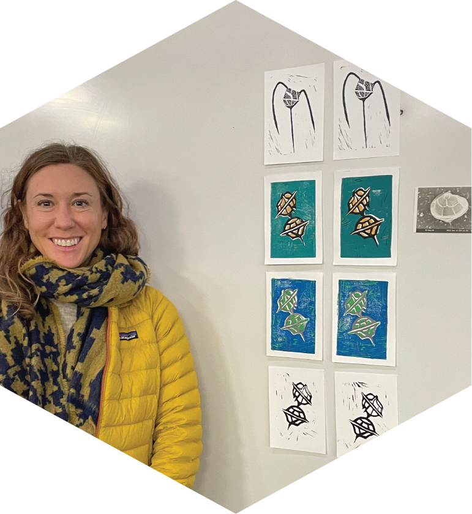

**\[NEWS\] January 23 - Art & Science Exhibit**   
Maggi presented plankton block prints at the USF CMS Art & Science Exhibit, the culminating event of sustained interaction between artists and scientists (https://www.usf.edu/marine-science/news/2025/a-journey-through-art-and-science-night-at-cms.aspx). Maggi and Andreas shared plankton forms as art with artistically inclined and scientifically curious participants in December. We brought the ever charismatic *Pyrodinium bahamense* to the event, where guests could watch the “Pyro”, as we affectionately call them, dance under the microscope. To complement the microscopy, Maggi brought plankton printing blocks so that guests could create their own plankton block prints. The goal was to both share our science and to inspire ocean-themed artistic ventures. At the final exhibit in January, artists displayed their works, including paintings, photography, poems, children’s books, and performances.

 
:::

### 2024

::: {layout="[10,-2,30]" layout-valign="center"}
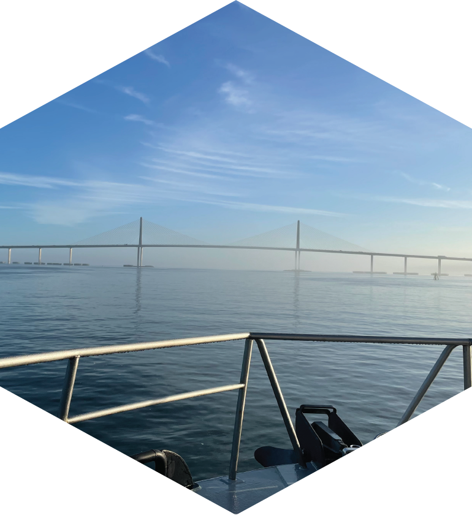

**\[NEWS\] December 17–19 - Second Hurricane Milton Response Cruise**   
Maggi, Andreas, and USF students Lilly Verrill ([Institute for Marine Sensing](https://imars.usf.edu/)) and Alexis Mitchem ([Breitbart Lab](https://www.marine.usf.edu/genomics/)), along with FWC researchers headed out to sea to reoccupy the same stations sampled in October following the major storms that affected our region. We worked around the clock to sample seawater for DNA sequencing to be able to see how the bacterial and phytoplankton communities have changed since we last sampled. The imaging flow cytobot (IFCB) and PlanktoScope were also constantly running to show us what plankton were in the water in real time.

 
:::

::: {layout="[10,-2,30]" layout-valign="center"}
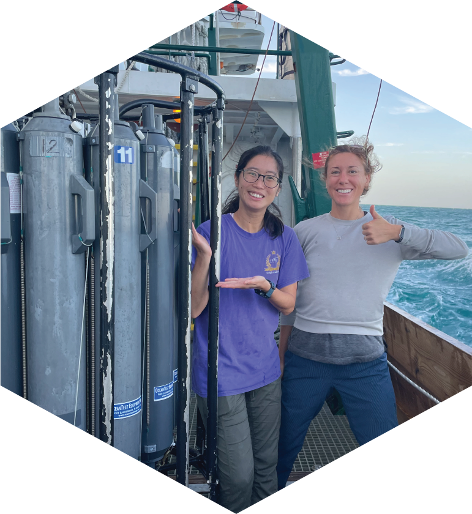

**\[NEWS\] October 21–23 - Hurricane Milton Response Cruise**   
Hurricane Helene brought unprecedented storm surge into Tampa Bay, whereas Hurricane Milton, just two weeks later, delivered flooding rains and extensive freshwater runoff into Tampa Bay. Satellite imagery analyzed by the [Optical Oceanography Laboratory at USF](https://optics.marine.usf.edu/) detected a large high-chlorophyll region outside Tampa Bay in the Gulf. The Florida Fish and Wildlife Conservation Commission (FWC) with the [USF Ocean Circulation Lab](https://new6.marine.usf.edu/index.html) organized a rapid response cruise to determine if there was a Florida red tide (*Karenia brevis*) bloom developing. Maggi, along with Jean Lim (USF Breitbart Lab), joined the cruise to characterize the free-living and particle-associated bacterial communities and the phytoplankton communities in Tampa Bay and in and around the bloom patch in the gulf. We had very rough weather, but we saw some interesting trends in community compositions and will be following up with additional cruises to see how the system rebounds from the hurricane disturbances.  

 
:::

::: {layout="[10,-2,30]" layout-valign="center"}
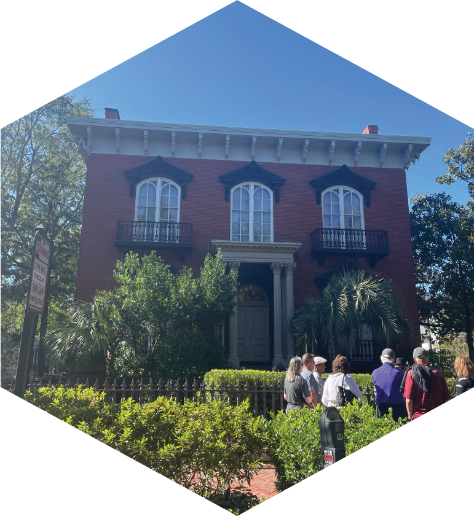

**\[NEWS\] October 17–20 - MetaEukomics Hackathon**   
Maggi and Andreas attended the OCB sponsored MetaEukomics Hackathon at UGA’s Skidaway Institute of Oceanography in Savannah, Georgia. The [“MetaEukomics: intercomparison of metatranscriptomic methods for characterizing microbial eukaryotic contributions to the biological carbon pump” project](https://www.us-ocb.org/metat-intercomparison/) is led by Harriet Alexander, Natalie Cohen, Sarah Hu, and Adrian Marchetti and aims to characterize the extent and sources of variability in metatranscriptome pipelines for marine microbial eukaryotes (i.e., phytoplankton, protists). Our lab is participating in both the wet lab and analysis portions of the intercalibration effort. We extracted RNA from samples shared by the organizers using two of our MICOlab RNA extraction protocols and then the RNA from our lab and other labs were processed and sequenced. At the hackathon, we met up with the other participating labs and analyzed the taxonomic and functional variability in the sequenced metatranscriptomes. The project leaders will be presenting our findings at the ASLO Aquatic Sciences Meeting 2025 and in an upcoming manuscript. 

 
:::

::: {layout="[10,-2,30]" layout-valign="center"}
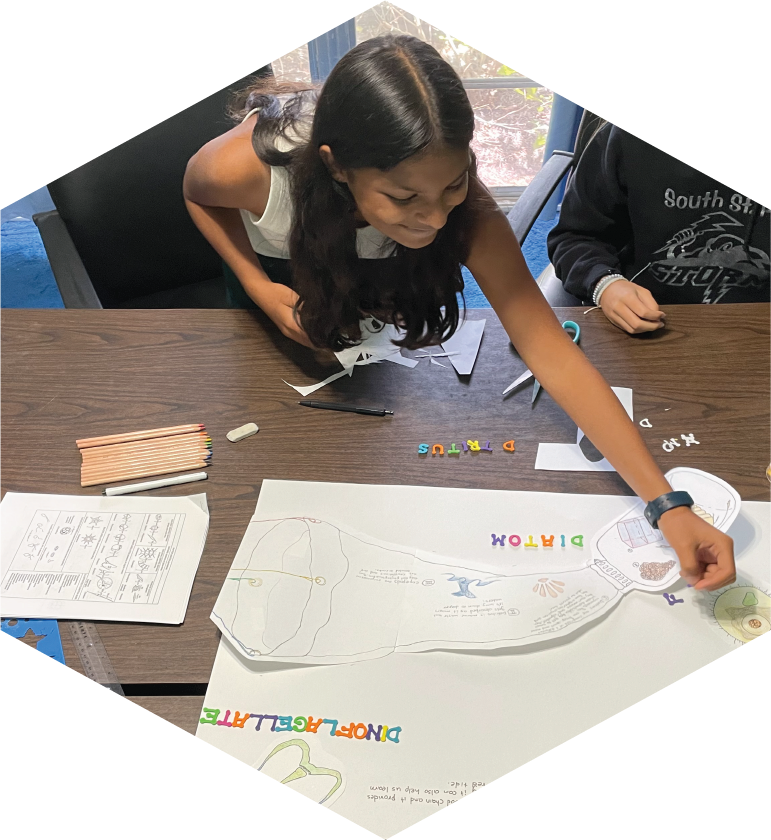

**\[POST\] June 28 - Oceanography Camp *Especially* for Girls**   Every year dozens of girls in that pivotal summer right before they enter high school fill CMS with singing, laughter, and unrestrained learning. The Oceanography Camp Especially for Girls is a CMS outreach program that has been running since 1991 and has the express goal of keeping girls excited about science at a time in their lives when many lose interest. This year, the MICOlab volunteered as a host lab for a group of girls to have a hands-on research experience. On Day 1, we headed outside to collect plankton and water samples from the CMS seawall. Next, we measured raw and extracted chlorophyll, looked at the plankton with the inverted microscope, and ran samples through the Planktoscope. On Day 2, the girls learned more about different types of plankton and classified all the plankton that they photographed with the planktoscope. Day 3 was for data analysis, poster making, and presentation prep. Finally, the girls gave a formal presentation of their work to a packed auditorium. By participating fully in each stage of research over the course of the week, these girls are better prepared for science in high school and beyond. And a lot of fun was had alongside Disney sing-a-longs and the best camp game: Ninja!! **MICOlab undergrad, Lauren, volunteered to help out with camp—read [her post](20240428_OCG.qmd) about the camp and her experience!**

 
:::

::: {layout="[10,-2,30]" layout-valign="center"}
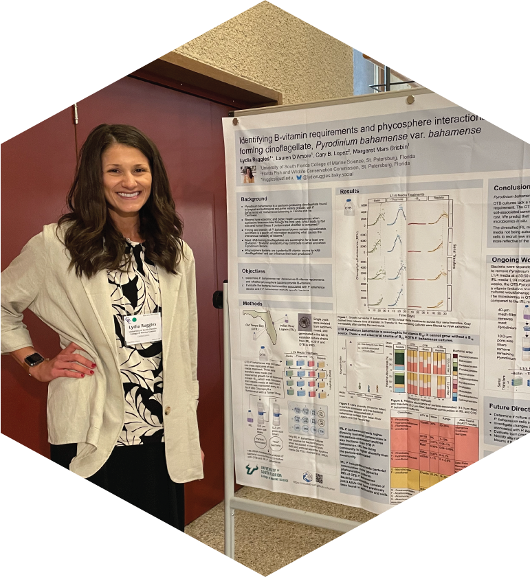

**\[POST\] June 9–14 - Microbes in the Mountains**   Lydia and Maggi attended the 2024 [Gordon Research Conference (GRC) on Marine Microbes](https://www.grc.org/marine-microbes-conference/2024/) in Les Diablerets Switzerland.This conference was Lydia’s first academic conference and first time traveling abroad! GRCs are fun and productive conferences because they are relatively small and focused in scope, and because of the summer-camp-esque vibe that they cultivate. GRCs are all inclusive (room, board, and registration are included) so that all attendees stay in the same lodging and eat all meals together. There are no overlapping sessions so everyone sees all the talks, which are longer format and generally feature leaders in the field. There is usually a long break in the middle of the day for excursions or group activities. At the Marine Microbes GRC, we took advantage of midday breaks to hike as many of the surrounding trails as possible and take in the awe-inspiring mountain views. Hiking and walking together was also a fabulous way to get to know other scientists and brainstorm new projects. Lydia did a beautiful job presenting her poster (check it out on [FigShare](https://figshare.com/articles/poster/_b_GRC_Poster_b_Identifying_B-vitamin_requirements_and_phycosphere_interactions_for_the_HAB-forming_dinoflagellate_i_Pyrodinium_bahamense_i_/26039800?file=47059924)!) and received very useful feedback from top scientists in her field. **Read more about her experience in [her post](20240615_GRC.qmd) about attending her first conference.** The SECOORA [Vembu Subramanian Ocean Scholars Award](https://secoora.org/vembu-subramanian-ocean-scholars-award/) helped fund Lydia’s participation in the GRC. 

 
:::

::: {layout="[10,-2,30]" layout-valign="center"}

**\[NEWS\] May 31 - New Publication from MICOlab PI, Maggi Brisbin, in *Estuaries & Coasts***   Okinawa Island, Japan, is beautiful through and through. Still, its beauty has two sides: the northern half of the island is mostly national park, with expansive jungles and quiet stretches of white coral beaches, whereas the southern half is heavily urbanized. Cities are exciting and beautiful in their own way, but they come with pollution and shoreline modification that can have repercussions for adjacent marine ecosystems. The contrasting land uses in the southern and northern halves of Okinawa set up a natural experiment for studying the impact of urbanization on coastal ecosystems. The study published in the CERF journal *Estuaries & Coasts* analyzed bacterial communities in coastal seawater at two urban and two rural sites every two weeks for a full year since shifts in microbial communities can be indicators or predictors of larger ecosystem disturbance. Physicochemical measurements (temperature, salinity, dissolved oxygen, turbidity, and major nutrients) accompanied water collections, and the relatively high frequency of measurements helped separate seasonal variability from true site differences. Results revealed higher diversity bacterial communities in coastal waters adjacent to urban sites throughout the year, with the increased diversity largely stemming from added bacteria with potential anthropogenic sources (wastewater and runoff). Increased nutrient loading and larger fluctuations in salinity at urban sites highlight the impact of concretization on runoff reaching the coast. The persistently altered state of microbial communities in urban coastal waters and interrupted seasonal cycle indicate that either urbanization causes a sustained disturbance or that communities there have reached a tipping point and a regime shift has occurred. There are serious implications for coastal water quality and ecosystem function in either case. **Read the full open-access article [here](https://link.springer.com/article/10.1007/s12237-024-01366-3)**.

 
:::

::: {layout="[10,-2,30]" layout-valign="center"}
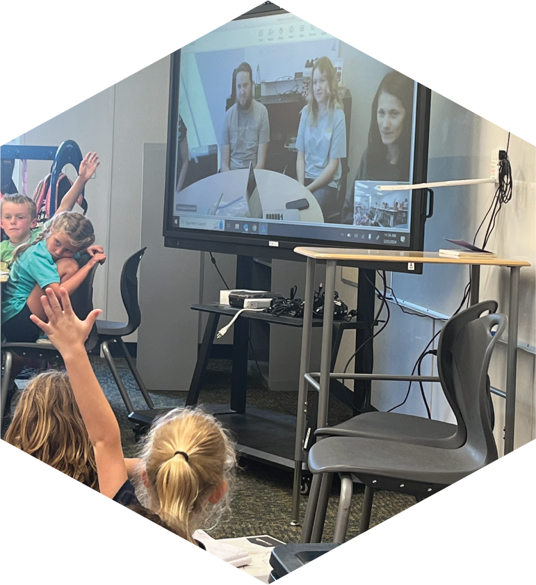

**\[POST\] May 22 - Here's to the future scientists! MICOlab zooms with second graders**   Connecting with future scientists is a common passion among MICOlab members. As the school year was coming to an end, the second grade students at Pine Island Academy in Jacksonville, FL, took some time out to meet with us over zoom and ask us all their questions about being scientists and doing science. Led by Lydia, we prepared a presentation of photos to illustrate what a day in the life of a marine scientist might entail, including lab work, coastal field work, and oceanographic research cruises. The students already studied oceanic zones and animals, such as the twilight zone and the benthos, so they were well prepared to ask us questions about research, becoming a scientist, and sharks. There were a lot of questions about sharks—What is the oldest shark in the ocean?, How do you catch sharks?, How do you know where to find sharks?, and more. There were also some fabulous questions about doing science like: What is your favorite part of your day? and, Do you have a secret lab? We were all impressed with the depth and breadth of the students’ knowledge and thoroughly enjoyed interacting with them. We are already looking forward to meeting with more classes next year. **Click [here](20240522_Skype.qmd) to read Lydia’s post about this outreach activity and see photos.**

 
:::

::: {layout="[10,-2,30]" layout-valign="center"}

**\[POST\] Feb. 10 - MICOlab puts plankton in the spotlight at St. Petersburg Science Festival!**   The [St. Petersburg Science Festival](https://stpetescifest.org/) is a two-day event hosted at the University of South Florida St. Petersburg campus every winter. This year, 12,000 visitors of all ages flocked to the USF campus to learn about science and engineering in the St. Pete region, with exhibits organized by the USF College of Marine Science, the Florida Fish and Wildlife Research Institute, USGS, NOAA, Eckerd College, the U.S. Coast Guard, Tampa Bay Watch and many more. The MICOlab exhibit featured the [Planktoscope](https://www.planktoscope.org/) running fresh samples from Tampa Bay and Virtual reality experiences from [Planktomania](https://planktomania.org/en/). Guests that visited our exhibit saw diatoms and copepods collected off the CMS seawall and imaged with the planktoscope. The planktoscope is portable high-throughput imaging microscope that is easy to operate and excellent for outreach. MICOlab group members explained how phytoplankton like diatoms are the base of the marine foodweb and zooplankton like copepods transfer organic carbon in phytoplankton up the food chain. Through the Planktomania VR, guests experienced an immersive tour through the biodiversity of planktonic organisms in the global ocean. Planktomania AR was a big hit among our youngest visitors, who colored in their favorite plankton and then saw it pop out of the paper in 3D with iPads running the Planktomania app. **Read MICOlab grad student Andreas Norlin's full account of the day [here](20240210_ScienceFest.qmd)**, and if you missed us this year we hope to see you at the next Science Festival!!

 
:::

### 2023

::: {layout="[10,-2,30]" layout-valign="center"}

**\[NEWS\] Nov. 23 - MICOlab grad student Lydia Ruggles is awarded SECOORA travel grant!**   In honor of Vembu Subramanian, SECOORA (The Southeast Coastal Ocean Observing Regional Association) established the Vembu Subramanian Ocean Scholars Award—an annually awarded grant to support undergraduate and graduate students presenting their research at national and international scientific conferences. Lydia submitted a proposal to present her thesis research at the Gordon Research Conference (GRC) on Marine Microbes taking place in Les Diablerets, Switzerland at the beginning of June 2024. Lydia's proposal, "Bacterial interactions with saxitoxin-producing *Pyrodinium bahamense* in Florida ecosystems: effects on growth, bloom formation, and toxin production", was selected along with two other USF CMS students, Emma Graves and Samantha D'Angelo. Read more about the award and this year's recipients [here](https://secoora.org/meet-the-winners-of-the-2023-vembu-subramanian-ocean-scholars-award/). Stay tuned to hear more about Lydia's first conference and international travel experience!

 
:::
