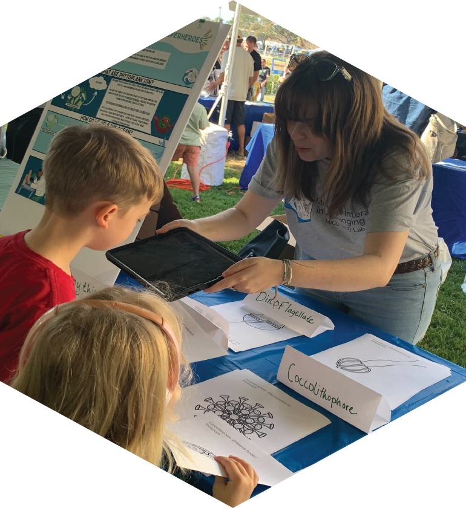
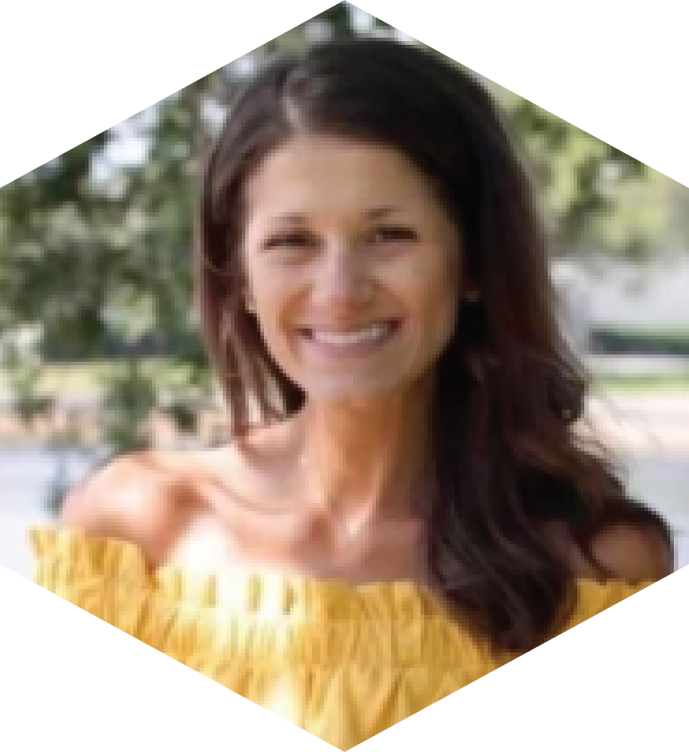

### 2024

::: {layout="[10,-2,30]" layout-valign="center"}

**Feb. 10 - MICOlab puts plankton in the spotlight at St. Petersburg Science Festival! **   
The [St. Petersburg Science Festival](https://stpetescifest.org/) is a two-day event hosted at the University of South Florida St. Petersburg campus every winter. This year, 12,000 visitors of all ages flocked to the USF campus to learn about science and engineering in the St. Pete region, with exhibits organized by the USF College of Marine Science, the Florida Fish and Wildlife Research Institute, USGS, NOAA, Eckerd College, the U.S. Coast Guard, Tampa Bay Watch and many more. The MICOlab exhibit featured the [Planktoscope](https://www.planktoscope.org/) running fresh samples from Tampa Bay and Virtual reality experiences from [Planktomania](https://planktomania.org/en/). Guests that visited our exhibit saw diatoms and copepods collected off the CMS seawall and imaged with the planktoscope. The planktoscope is portable high-throughput imaging microscope that is easy to operate and excellent for outreach. MICOlab group members explained how phytoplankton like diatoms are the base of the marine foodweb and zooplankton like copepods transfer organic carbon in phytoplankton up the food chain. Through the Planktomania VR, guests experienced an immersive tour through the biodiversity of planktonic organisms in the global ocean. Planktomania AR was a big hit among our youngest visitors, who colored in their favorite plankton and then saw it pop out of the paper in 3D with iPads running the Planktomania app. **Read MICOlab grad student Andreas Norlin's full account of the day [here](20240210_ScienceFest.qmd)**, and if you missed us this year we hope to see you at the next Science Festival!! 

 

:::

### 2023

::: {layout="[10,-2,30]" layout-valign="center"}

**Nov. 23 - MICOlab grad student Lydia Ruggles is awarded SECOORA travel grant!**   In honor of Vembu Subramanian, SECOORA (The Southeast Coastal Ocean Observing Regional Association) established the Vembu Subramanian Ocean Scholars Award—an annually awarded grant to support undergraduate and graduate students presenting their research at national and international scientific conferences. Lydia submitted a proposal to present her thesis research at the Gordon Research Conference (GRC) on Marine Microbes taking place in Les Diablerets, Switzerland at the beginning of June 2024. Lydia's proposal, "Bacterial interactions with saxitoxin-producing *Pyrodinium bahamense* in Florida ecosystems: effects on growth, bloom formation, and toxin production", was selected along with two other USF CMS students, Emma Graves and Samantha D'Angelo. Read more about the award and this year's recipients [here](https://secoora.org/meet-the-winners-of-the-2023-vembu-subramanian-ocean-scholars-award/). Stay tuned to hear more about Lydia's first conference and international travel experience! 

 

:::

