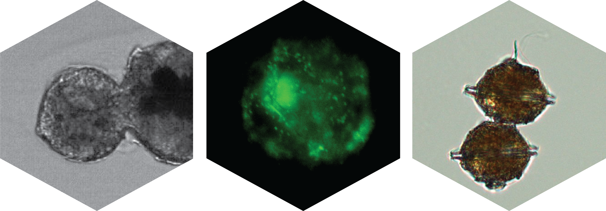
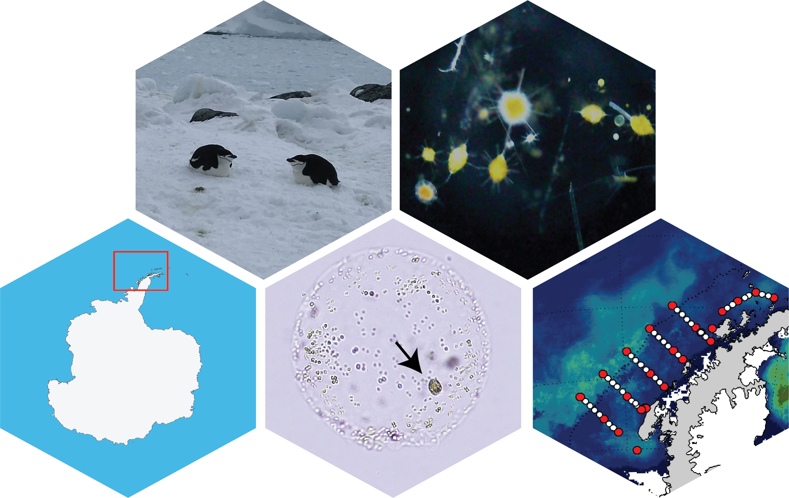
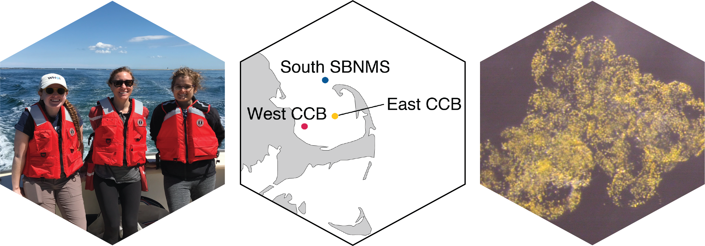

## **B-vitamins, bacteria, and harmful algal bloom (HAB)-forming *Pyrodinium bahamense*** 

The dinoflagellate *Pyrodinium bahamense* is found in subtropical and tropical estuaries globally and biosynthesizes the neurotoxin Saxitoxin. Saxitoxin can bioaccumulate in filter-feeding shellfish and other marine organisms. If these contaminated food sources are consumed by humans, Paralytic Shellfish poisoning may ensue, which can lead to death. As a result, *Pyrodinium bahamense* blooms are a major public health concern, and disentangling the many factors that contribute to *Pyrodinium* bloom frequency and intensity is a critical research area. While many HAB-forming dinoflagellates are known to require external sources of B-vitamins to grow, the B-vitamin requirements for *Pyrodinium* have not been reported. B-vitamins can be limiting in coastal and open ocean waters and could contribute to bloom formation. Having discovered that *Pyrodinium* is a vitamin B12 (cobalamin) auxotroph (i.e., it cannot grow without a B12 source) in our preliminary work (Ruggles et al., in prep), we are now working to determine whether symbiotic bacteria provide B12 to *Pyrodinium* or if there is another, potentially anthropogenic, source. MICOlab graduate student, Lydia Ruggles, is running large-scale co-culture experiments with *Pyrodinium* and marine bacteria and is using an array of methods, including fluorescent microscopy, flow cytometry, and full-length 16S metabarcode amplicon sequencing to determine if *Pyrodinium* associates with specific bacteria and if those bacteria can promote *Pyrodinium* growth when B12 is limiting.

{fig-align="center"}

*Left: A star is born.* Pyrodinium bahamense *cell division, caught with an Attune CytPix imaging flow cytometer; Center:* Pyrodinium bahamense *stained with SYBR green nucleic acid fluorescent dye and imaged with a Zeiss Axioscope 7; Right: A* Pyrodinium bahamense *doublet imaged with a Zeiss PrimoVert.*

## **The role of mixotrophy and symbiosis in the rise and fall of spring *Phaeocystis antarctica* blooms along the Western Antarctic Peninsula** 

The Western Antarctic Peninsula (WAP) region of the Southern Ocean is a highly dynamic and productive ecosystem that is undergoing rapid changes due to global climate change. The spring and summer seasons support high biomass phytoplankton blooms, but the winter is completely devoid of light. Therefore, mixotrophy and symbiosis may be especially important in this ecosystem as a means for photosynthetic organisms to overwinter. *Phaeocystis antarctica* is an abundant phytoplankton in the Southern Ocean that has a complex multi-morphic life cycle and contributes to myriad mixotrophic and symbiotic arrangements. A key facet of *P. antarctica*'s life history is its colonial phase, where thousands of cells are embedded in self-secreted mucilaginous, spherical colonies, which make up the majority of *Phaeocystis* bloom biomass. The colony creates a unique interface for interactions with bacteria and other microeukaryotes: closely related *P. globosa* colonies host specific microbiomes that can relieve vitamin limitation (Mars Brisbin et al. 2022) and the kelptoplastidic Ross Sea Dinoflagellate uses *P. antarctica* colonies as a convenient hunting ground by entering colonies and stealing chloroplasts from immobile *P. antarctica* cells. *Phaeocystis* species are also the (almost) exclusive photosymbiont of acantharian radiolarians (Mars Brisbin et al. 2018), with acantharians in the Southern Ocean hosting *P. antarctica*. This project seeks to illuminate how the prevalence of these interactions with *P. antarctica* in the WAP influnece spring phytoplankton bloom dynamics. Specifically, do bacterial or other interactions prime *P. antarctica* to outcompete diatoms at the outset of the spring bloom and do interactions with mixotrophic dinoflagellates or other protists (such as acantharians) contribute to the succession from *P. antarctica* to diatoms in the mid to late spring? MICOlab graduate student Andreas Norlin will be investigating these questions by delving into community-wide gene expression in samples collected during the WAP spring bloom through the Palmer Long Term Ecological Research (LTER) Program.

{fig-align="center"} *Top left: Chinstrap penguins in the Western Antarctic Peninsula; Top right: An assortment of acantharians with photosynthesic endosymbionts caught during a* Phaeocystis *bloom off the WAP shelf; Bottom left: Map of Antarctica with the WAP region highlighted in a red square; Bottom middle: A* Phaeocystis antarctica *colony collected from the spring* P. antarctica *bloom in the WAP with a kletoplastidic dinoflagellate (arrow) within the colony matrix; Bottom right: Mean spring sea surface chlorophyll concentrations in the WAP in 2021 with the Palmer LTER sampling stations overlaid. Satellite data synthesized by Dr. Jessie Turner, UCONN.*

## **Changing spring bloom composition and phenology in Cape Cod Bay** 

Phytoplankton dynamics are central to the productivity of marine ecosystems. The species composition of major bloom events determines how much phytoplankton-derived organic carbon is available to higher trophic levels, recycled in the microbial loop, or exported. Hence, changing bloom dynamics have downstream effects on ecosystem functioning and biogeochemical cycling. In the coastal Massachusetts Bay System, including Cape Cod Bay, strong spring diatom blooms have historically supported the higher trophic levels that fuel the vibrant blue economy in the region. Through the Massachusetts Water Resources Authority (MWRA)'s long term monitoring in the region, it has become apparent that major changes in spring bloom timing and composition are underway: the haptophyte *Phaeocystis pouchetii* has emerged as a dominant contributor to spring bloom biomass, and in 2023, the traditional spring bloom was supplanted by a high-biomass dinoflagellate (*Tripos muelleri*) bloom that led to early-season benthic hypoxia and anoxia that persisted throughout the summer. In a collaborative effort between Dr. Amy Costa at the Center for Coastal Studies Province Town and Arianna Krinos, Harriet Alexander, and Mak Saito at the Woods Hole Oceanographic Institution, we augmented the last three years of the MWRA time series with whole community meta-omics (i.e., 16S rRNA metabarcoding, metatranscriptomics, and metaproteomics), allowing comprehensive taxonomy and the realized physiological state of different microbes to be directly evaluated across seasonal and annual cycles. Together, these diagnostic ‘omics data will shed light on the molecular mechanisms that favor the increasing emergence of *Phaeocystis* and dinoflagellate blooms in Massachusett's coastal ecosystems, as well as on how plankton communities respond to marine heatwaves and changing climate patterns.

{fig-align="center"}

*Left: Out sampling in Cape Cod Bay with the Center for Coastal Studies Provincetown; Center: Primary sampling sites for the project in Cape Cod Bay. These sites are a subset of the full MWRA monitoring program. CCB - Cape Cod Bay, SBNMS - Stellwagen Bank National Marine Sanctuary; Right: A* Phaeocystis pouchetii *colony isolated from Cape Cod Bay water.*
