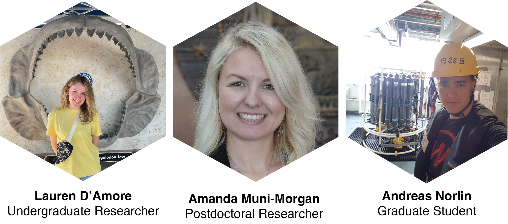

::: {layout="[10,-2,30]" layout-valign="center"}

**Margaret (Maggi) Mars Brisbin** (she/her) is the PI of the MICOlab and an Assistant Professor at the University of South Florida's College of Marine Science. Maggi completed her Ph.D. at the Okinawa Institute of Science and Technology (Japan), where she worked under Prof. Satoshi Mitarai to comprehensively characterize the symbiosis between acantharian protists and the Haptophyte phytoplankton *Phaeocystis*. Side projects and ongoing interests from Okinawa include investigating how typhoons and urbanization disturb coastal ecosystems. Recent research focuses on positive and negative interactions between *Phaeocystis* and their colony microbiomes, and the impact these interactions may have on bloom formation in different regions. Maggi is passionate about science communication, outreach, and building an inclusive and supportive lab.    

:::

::: {layout="[10,-2,30]" layout-valign="center"}
 

**Olivia Blondheim** transferred to the MICOlab in Fall 2024 to complete her dissertation research. Her project focuses on the water filtration services of the eastern oyster in Tampa Bay. She is measuring the water filtration rates of oysters on both natural (i.e., oyster reefs) and artificial (i.e., mangrove prop roots, vertical oyster gardens) substrates. She is also experimentally evaluating whether oysters can diminish the severity of harmful algal blooms in warming ocean conditions. When Olivia is not in the lab or the field, you can usually find her assembling vertical oyster gardens with the community at outreach events, advocating for sustainable aquaculture in D.C., or photographing wildlife at one of her favorite local parks.
:::

::: {layout="[10,-2,30]" layout-valign="center"}

**Lydia Ruggles** joined the MICOlab as an M.Sc. student in the Fall of 2023. She is interested in understanding the relationship between the saxitoxin-producing species *Pyrodinium bahamense* and bacteria. This interest began through her work at the Florida Fish and Wildlife Research Institute in the Harmful Algal Bloom group, where she continues to assist with physiological and molecular research. 

:::

::: {layout="[10,-2,30]" layout-valign="center"}

**Lilianna Giuffrida** joined the MICO lab as an M.Sc. student in the Fall of 2025. She is interested in how the dinoflagellate species *Pyrodinium bahamense* obtains vitamins in the waters of Old Tampa Bay. She is currently working on a project to identify the main source of vitamin B12 for *P. bahamense*. While also assisting with other ongoing projects, she is becoming well versed in microbiology and working with phytoplankton cultures. Lilianna loves the Florida manatees and wants to keep their habitat healthy - so it is important to monitor the microalgae that they share a home with! She is passionate about sustainability and conservation, and aims to pursue a career in algal biotechnology. 

:::

::: {layout="[10,-2,30]" layout-valign="center"}

**Gnasher Brisbin** is a 13-year-old Australian Cattle Dog (Red Heeler) who is deeply interested in reef fish and sea cucumbers. He is currently studying the effect of loud noises (barking) on prey fish behavior. In his spare time, he enjoys sun bathing, walking, sleeping, and eating. He is the number one supporter of MICOlab publications being written.
:::

::: {layout="[10,-2,30]" layout-valign="center"}

**Ruby Brisbin** is a mini American Shepherd (a.k.a. mini Aussie) puppy and recent addition to the MICOlab. She is still developing her academic interests, but is leaning towards terrestrial ecology as she is especially interested in the activity of native and invasive anoles in Florida. In her free time, she enjoys sailing, walking, running, jumping, and Frisbee. 
:::

 
 

-------------

 

*Past Members*

 
{fig-align="center"}

 

-------------

 

*Group Photos*

::: {fig-align="center"}

**2024 End of the Year BBQ.** *Clockwise from top left: Lauren, Abbey, Lydia, Maggi, Andreas, Gnasher.*
:::

::: {fig-align="center"}

**2024 Halloween Party.** *From left: Elf (Olivia), Farmer (Lydia), Tennis Pro (Andreas), Jurassic Park's Dr. Ellie Sattler (Lauren), Black Swan (Maggi).*
:::

::: {fig-align="center"}

**2024 VOGs and Egg Nog outreach event planned and executed by Olivia.** *From left: Andreas, Olivia, Maggi, Lauren.*
:::

