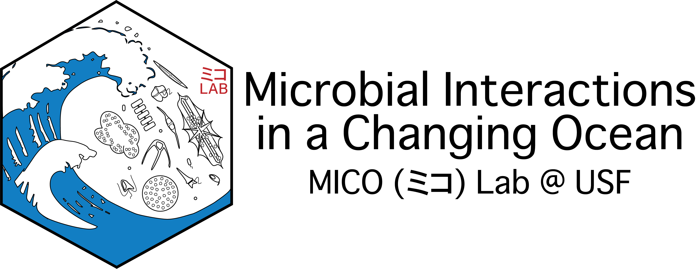
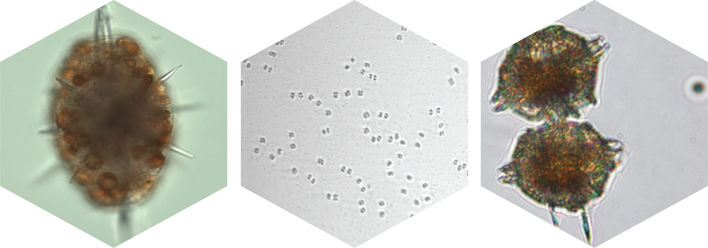
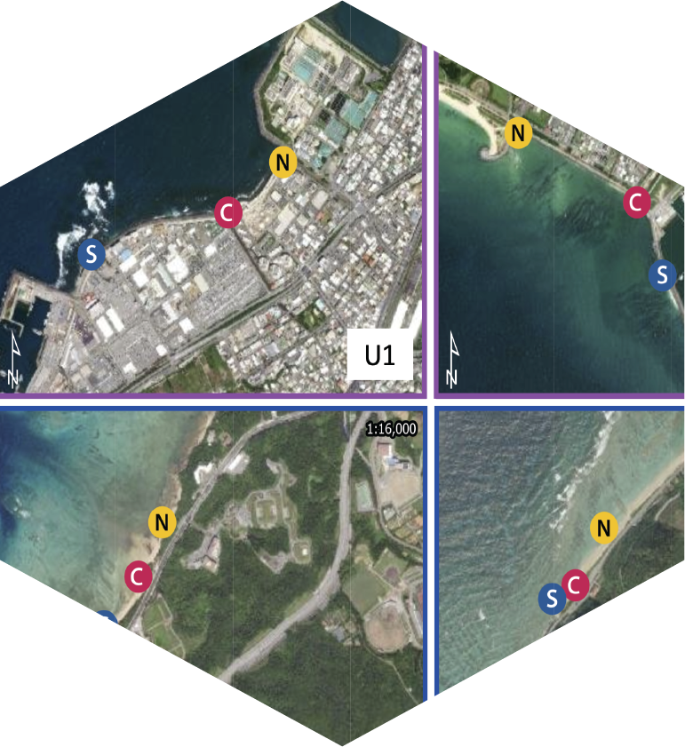

{fig-align="center"}

The MICO Lab at USF is led by **Dr. Margaret (Maggi) Mars Brisbin**. The core focus of the lab is to unravel and interpret interactions between marine microbes in the context of changing ocean ecosystems. Overarching research aims are to determine how microbial interactions contribute to biogeochemical cycles and ecosystem function, how these interactions will respond to climate change, and how changes in the dynamics of these relationships will feedback on climate change impacts. The MICO lab uses multiple meta'omics and advanced microscopy techniques in conjunction with culture experiments and environmental sampling to tackle the following questions:

1.  **What are the mechanisms of interaction between microbes in aquatic systems?** How do phytoplankton or other hosts identify and select or recruit specific symbiotic partners? How are the relationships mediated? How does the relationship benefit the organisms involved, *e.g.*, does the relationship provide a limiting nutrient or increase photosynthetic output?
2.  **How do microbial interactions evolve?** How quickly are new interactions established? How resilient are interactions to environmental change? Will climate impacts "break" or otherwise impact ecologically important microbial interactions?
3.  **What are the ecological impacts if specific microbial interactions are disturbed?** Will carbon fixation or sequestration decrease if interactions are diminished? How would such changes propagate through the food web?

The MICO lab is microbe agnostic and is generally intrigued by all interesting and ecologically relevant microbial interactions. Some systems of particular interest are acantharian-*Phaeocystis* symbioses, *Phaeocystis* colony-microbiome interactions, and bacterial interactions with the HAB-forming dinoflagellate *Pyrodinium bahamense*.

{fig-align="center"}

*Left: An acanatharian with* Phaeocystis antarctica *endosymbionts collected from the Southern Ocean on the Palmer LTER cruise and imaged with Prakash Lab custom microscopes; Center: A* Phaeocystis antarctica *colony speckled with bacteria that was imaged with the Imaging Flow Cytobot aboard the R/V Nathaniel B. Palmer in the Southern Ocean; Right:* Pyrodinium bahamense *cells collected in Old Tampa Bay and imaged with light microscopy by FWRI.*

-------

**News & Posts**

*2024*

::: {layout="[10,-2,30]" layout-valign="center"}

**May 31 - New Publication from MICOlab PI, Maggi Brisbin, in *Estuaries & Coasts* **   
Okinawa Island, Japan, is beautiful through and through. Still, its beauty has two sides: the northern half of the island is mostly national park, with expansive jungles and quiet stretches of white coral beaches, whereas the southern half is heavily urbanized. Cities are exciting and beautiful in their own way, but they come with pollution and shoreline modification that can have repercussions for adjacent marine ecosystems. The contrasting land uses in the southern and northern halves of Okinawa set up a natural experiment for studying the impact of urbanization on coastal ecosystems. The study published in the CERF journal *Estuaries & Coasts* analyzed bacterial communities in coastal seawater at two urban and two rural sites every two weeks for a full year since shifts in microbial communities can be indicators or predictors of larger ecosystem disturbance. Physicochemical measurements (temperature, salinity, dissolved oxygen, turbidity, and major nutrients) accompanied water collections, and the relatively high frequency of measurements helped separate seasonal variability from true site differences. Results revealed higher diversity bacterial communities in coastal waters adjacent to urban sites throughout the year, with the increased diversity largely stemming from added bacteria with potential anthropogenic sources (wastewater and runoff). Increased nutrient loading and larger fluctuations in salinity at urban sites highlight the impact of concretization on runoff reaching the coast. The persistently altered state of microbial communities in urban coastal waters and interrupted seasonal cycle indicate that either urbanization causes a sustained disturbance or that communities there have reached a tipping point and a regime shift has occurred. There are serious implications for coastal water quality and ecosystem function in either case. **Read the full open-access article [here](https://link.springer.com/article/10.1007/s12237-024-01366-3)**. 

 

:::

::: {layout="[10,-2,30]" layout-valign="center"}

**Feb. 10 - MICOlab puts plankton in the spotlight at St. Petersburg Science Festival! **   
The [St. Petersburg Science Festival](https://stpetescifest.org/) is a two-day event hosted at the University of South Florida St. Petersburg campus every winter. This year, 12,000 visitors of all ages flocked to the USF campus to learn about science and engineering in the St. Pete region, with exhibits organized by the USF College of Marine Science, the Florida Fish and Wildlife Research Institute, USGS, NOAA, Eckerd College, the U.S. Coast Guard, Tampa Bay Watch and many more. The MICOlab exhibit featured the [Planktoscope](https://www.planktoscope.org/) running fresh samples from Tampa Bay and Virtual reality experiences from [Planktomania](https://planktomania.org/en/). Guests that visited our exhibit saw diatoms and copepods collected off the CMS seawall and imaged with the planktoscope. The planktoscope is portable high-throughput imaging microscope that is easy to operate and excellent for outreach. MICOlab group members explained how phytoplankton like diatoms are the base of the marine foodweb and zooplankton like copepods transfer organic carbon in phytoplankton up the food chain. Through the Planktomania VR, guests experienced an immersive tour through the biodiversity of planktonic organisms in the global ocean. Planktomania AR was a big hit among our youngest visitors, who colored in their favorite plankton and then saw it pop out of the paper in 3D with iPads running the Planktomania app. **Read MICOlab grad student Andreas Norlin's full account of the day [here](20240210_ScienceFest.qmd)**, and if you missed us this year we hope to see you at the next Science Festival!! 

 

:::

*2023*

::: {layout="[10,-2,30]" layout-valign="center"}

**Nov. 23 - MICOlab grad student Lydia Ruggles is awarded SECOORA travel grant!**   In honor of Vembu Subramanian, SECOORA (The Southeast Coastal Ocean Observing Regional Association) established the Vembu Subramanian Ocean Scholars Award—an annually awarded grant to support undergraduate and graduate students presenting their research at national and international scientific conferences. Lydia submitted a proposal to present her thesis research at the Gordon Research Conference (GRC) on Marine Microbes taking place in Les Diablerets, Switzerland at the beginning of June 2024. Lydia's proposal, "Bacterial interactions with saxitoxin-producing *Pyrodinium bahamense* in Florida ecosystems: effects on growth, bloom formation, and toxin production", was selected along with two other USF CMS students, Emma Graves and Samantha D'Angelo. Read more about the award and this year's recipients [here](https://secoora.org/meet-the-winners-of-the-2023-vembu-subramanian-ocean-scholars-award/). Stay tuned to hear more about Lydia's first conference and international travel experience! 

 

:::

